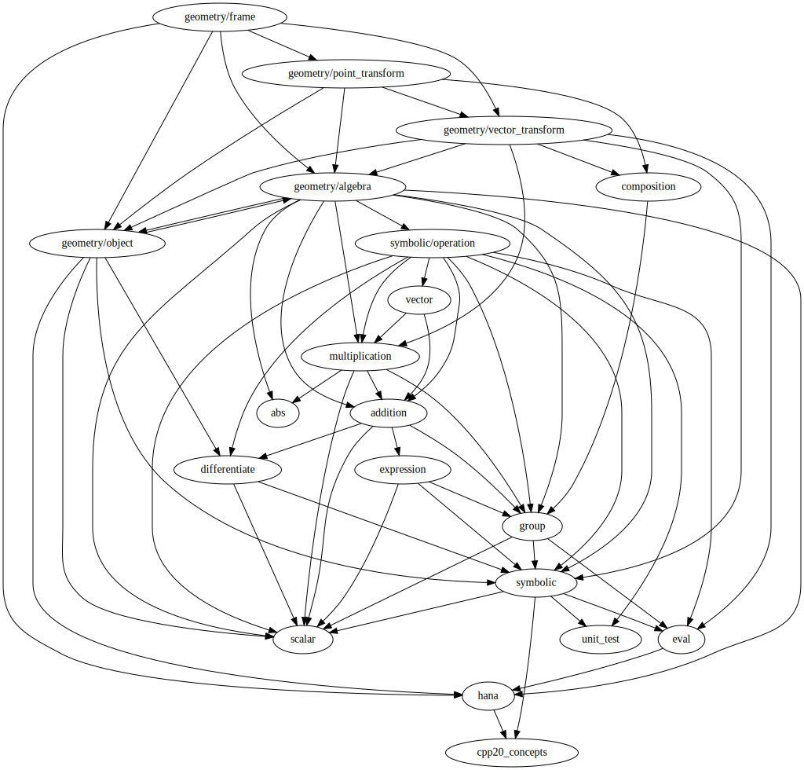

* [Implementation](#implementation)
* [Cheat sheet](#cheat-sheet)
* [Example](#example)
* [Requirements](#requirements)

# What is it ?
This is a C++ math library, with a focus on geometry. It provides :

* **abstract mathematical objects**

  groups, vector spaces, algebras, etc.

* **some specific instances of such objects**

  geometric algebra, which includes complex numbers, quaternions, and much more.

  geometric transformation groups generated by rotations, translations, homothecies. (TODO: inversions,symmetries)

* **unambiguous objects**
  
  In mathematics in general, it is easy to mistake an object for one of its particular representation. 

  In particular, in computer science, geometrical objects often have the same type as their internal representation : geometrical transformations are defined as matrices, vectors, quaternions, etc, and points are defined as vectors. The problem with that is that different objects sometimes share the same representation. Such ambiguous representations can confuse humans reading the code and prevent compilers from detecting bugs.

  Typical such confusions are :

  * between a set of coordinates and a vector. A set of numbers, let's say {1., 2., 0.}, is *not* a vector. It can *represent* a vector, if and only if it is attached to a set of basis vectors : then it typically represents the linear combination of those basis vectors with the given coefficients. However, this attached set of basis vectors is often not explicit in code (for example `Vector3d{1., 2., 0.}`), so that the compiler doesn't know in which frame those coordinates are, and maybe humans reading the code do not either. 

    Using this library, you will first define basis vectors (for example `north`,`east`,`up`), which will have distinct types with zero memory footprint, and then define vectors as linear combinations of basis vectors (for example `1.2*north+2*east`). Of course, in this example, the computer will store the resulting vector as a set of 2 numbers, but both compilers and humans reading the code know the attached basis vectors. Also note that even if you defined 3 basis vectors, only 2 numbers are stored when you define a 2D vector.

  * between vectors (actually representing translations) and points. A point can be represented by the translation which transforms a given fix point (called the origin) to it, but a point is *not* a translation (a point has no magnitude, no direction). 

    Using this library, you will first define an origin, which is a special point defined as a type with zero memory footprint (a default origin is defined for you if you use only one), then apply geometrical transformations on it to form new points. For convenience, you can give any point and a vector to the `point()` function (for example `math::geometry::point(my_home, 1.2*north+2*east)`), which will define a translation from your vector, apply it to the given point, and return the result. You can also provide only a vector if you use the default origin (for example `math::geometry::point(1.2*north+2*east)`), but it is obviously less clear.

    If you have another frame, you can also use it (for example `math::geometry::point(my_desk, 0.12*forward+0.23*right)`). 

  * between a vector rotation and a quaternion or a matrix. Actually, a vector rotation is mathematically defined only by the way it tranforms vectors, so it should have its own interface for transforming vectors and its representation should be an implementation detail.

    Using this library, you will define vector rotations from a plane and an angle (for example `math::geometry::simple_rotation_t{math::geometry::plane(x,y), 0.35*math::geometry::half_turn}`). When working in more than 3 dimensions, you can compose simple rotations (working in a single plane) to make rotations in several orthogonal planes.

  * between a vector rotation and a point rotation. Here even the language is ambiguous since there is only one word for both concepts : rotation. A point rotation has a center, a vector rotation does not. When points are represented by vectors (translations of an implicit origin), a vector rotation can represent a point rotation around the origin. 

    Using this library, you will define point rotations from a center, a plane, and an angle (for example `math::geometry::point_rotation(D, math::geometry::plane(x,y), 0.35*math::geometry::half_turn)`). You can also provide a center and a vector rotation. When working in more than 3 dimensions, you can compose simple rotations to make more complex ones. 
  
# Implementation

## strong typing
Mathematical objects and expressions are represented by C++ types. Operations on those types are made by constexpr functions.
It can effectively turn your compiler into a symbolic math software, in which case the resulting program would only print the result that have been computed at compile time. 
Most program will of course use runtime values, but the library will try to do everything it can do at compile time, so prefer using `math::integer<2>` and `math::ratio<1,2>` instead of `2.0` and `0.5` in your code.

## extensible dimensions
No need to specify in advance a space in which to work, new types are generated if new dimensions appear in an expression. If you write `auto a=3*x+4*y`, `a` stores two values in a type generated from the expression `"double*x+double*y"`. Then, writing `a+2.5*z` will just generate a larger type holding three values (assuming `z` is not a combination of `x` and `y`).

## small and easy to read
It is small because it exploits work from mathematicians. They have put many concepts into the most beautiful form they could find : both as general and as simple as possible. Using those concepts in code means factorized and simple code.

## metaprogramming, expression templates
The library takes care of returning the best types in terms of memory and geometric signification for every math operation or function. An important example is the composition of geometric transformations : any composition of rotations will produce a rotation (and be stored internally as a quaternion), a composition of any number of rotations with any number of translations in any order will generate a type storing a single rotation followed by a single translation (stored internally as a quaternion and a vector), and similar simplifications are made automatically if you add homothecies in the mix, always generating the simplest possible type, which will also limit the number of different C++ types in the whole program. 

The library uses C++17 with concepts, which provides human friendly template programming.

The metaprogramming is implemented by overloading functions, not by specializing types. This technique is inspired from the boost::hana metaprogramming library, see https://boostorg.github.io/hana/#tutorial-quadrants-about for a detailed explanation of why metaprogramming should be implemented like that.

I am waiting for C++ modules to speed up compilation time. 

## unit tests
They are a good place to look for examples.
They make sure things work as intended.
When testing runtime values, use only values which have a finite representation in base 2, because strict equality is checked.

## dependency graph of modules


# Cheat sheet
## operators
`A+B` : addition

`A*B` : multiplication (which is also the geometric product)

`A|B` : inner product

`A^B` : outer product

`(A,B)` : composition (of geometric transformations)

## geometric objects
`"x"_direction_positive` : direction (and basis vector of geometric algebra which squares to +1)

`"x"_direction_negative` : direction (and basis vector of geometric algebra which squares to -1)

`point(origin, vector)` : defines a point, translated by vector from origin

## point transformations
`translation_t{vector}` : defines a translation from a vector

`make_homothecy(center,ratio)` : defines a homothecy

`make_point_rotation(center,plane,angle)` : defines a point rotation

## vector transformations
`simple_rotation_t{plane,angle}` : defines a vector rotation (transforms directions)

`scaling_t{factor}` : defines a scaling (transforms distances)

# Example
```
#include"geometry/point_transform.h"

namespace math=godef::math;
using namespace math::geometry::literals;
using math::half_turn;
using math::ratio;
using math::integer;

static constexpr auto x="x"_direction_positive; 
static constexpr auto y="y"_direction_positive; 
static constexpr auto z="z"_direction_positive; 
static constexpr auto t="t"_direction_negative; 

auto constexpr O=math::geometry::default_origin;    //stores nothing
auto constexpr A=math::geometry::point(x+y);   //stores nothing
auto constexpr B=math::geometry::point(x+y+z); //stores nothing
auto constexpr C=math::geometry::point(ratio<-1,3>*x+ratio<2,3>*y+ratio<3,5>*t); //stores nothing
auto           D=math::geometry::point(24.0*x-18.0*y+1.5*z); //stores 3 double

auto constexpr translation=math::geometry::translation_t{integer<4>*x}; //stores nothing
auto constexpr homothecy=math::geometry::make_homothecy(A,ratio<1,4>); //converted to an homothecy centered on O followed by a translation, stores a ratio and a vector (nothing in this case because everything is known at comile time)
auto constexpr rotation1=math::geometry::make_point_rotation(O, math::geometry::plane(y,z), ratio<1,2>*half_turn); //stores nothing
auto constexpr rotation2=math::geometry::make_point_rotation(C, math::geometry::plane(x,t), ratio<235,1279>); //a boost is a rotation in a mixed plane (containing both positive and negative directions) ; stores nothing
auto rotation3=math::geometry::make_point_rotation(D, math::geometry::plane(x,y), 0.35*half_turn); //converted to a rotation centered on O followed by a translation (stored as an angle and a 3D vector, so 4 double)

auto transform=(translation,rotation1,homothecy,rotation3); //converted to an homothecy followed by a rotation followed by a translation  
auto transformed_C=transform(C); //the homothecy is applied (no op), then the rotation is applied (only the x and y components of C are affected, the t component is still a compile-time value at this point, minimal amount of computation is done), then the translation is applied (x,y,z components are computed and stored in 3 double, t component is still a compile-time value (the transformation operates in the (x,y,z) space, except for a dilation with a compile-time factor))
```
# Requirements
* C++17
* C++-concepts
* Boost.Hana
* CMake

Only tested on Linux with GCC.

# Bugs and feature requests

If you encounter a bug or if you think that some new functionality would be helpful, please report it here https://github.com/godefv/math/issues . 
